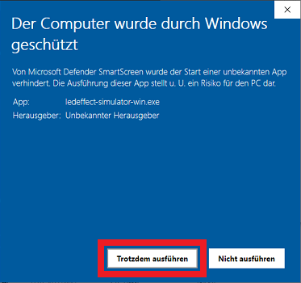

# Klipper LED Effects Simulator
 

## What is LED Effects Simulator?
:red_circle::yellow_circle::green_circle:**LED Effects Simulator** is a standalone application for Windows & MacOS to create and test your own LED Effects.
  
It is possible to create a drop-in configuration for your printer.cfg so that the LED Effects looks the same as in the simulator.
  
It is capable of showing the created LED Effects in realtime with the changes you made.
  
The LED Effects Simulator is coded and maintained by me and released under GPL-3.0 license.
  
If you want to support me, either contribute code or
 

  

## Where can i get it?
You can download the latest Version under the Releases section of this Repo or using [:page_facing_up: this Link](https://github.com/julianschill/klipper-led_effect/releases "Releases").
 

Example: Download under Releases section

 

 
_Klick on **Assets** to dropdown the download links and choose the Windows (.exe) or MacOS (.zip) version for download._

 

## How to install LED Effects Simulator
**LED Effects Simulator** is a standalone application with build-in ressources. It is portable and you don't need to install it.
  
Just download the app and you are ready to go.
  
You may see a message that this app is not secure. You can launch the app according to the following description:

Start Application under Windows

 
Klick on the highlighted Text ("More info") to show the "Run anyway" button.  

 

Then klick on the "Run anyway" button to launch the app.

 

Start Application under MacOS

 
soon:tm:

 

## How to get started
You can create LED Effecs in short time on your own.
  
If you want, you can follow the step-by-step-tutorial to create your first LED Effects and learn how the simulator is working.
  
[:page_facing_up: Step-by-step-tutorial](TUTORIAL_SIMULATOR.md "Step-by-step-tutorial")

 

LED Effects Simulator

 

